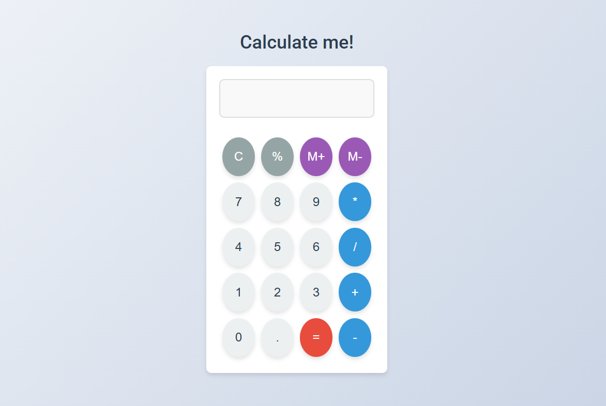

# Basic Calculator App

A simple web-based calculator built using **HTML**, **CSS**, and **JavaScript**. It supports basic arithmetic operations like addition, subtraction, multiplication, and division.

## Features
- Addition, Subtraction, Multiplication, Division
- Responsive layout
- Clean UI with CSS styling

## Tech Stack
- HTML5
- CSS3
- JavaScript (Vanilla JS)

## Demo


## How to Use
1. Clone the repository:
   ```bash
   git clone https://github.com/theshubhangishukla/basic-calculator-app.git
2.Open index.html in any web browser.

Author
Shubhangi Shukla

Connect with me on LinkedIn
